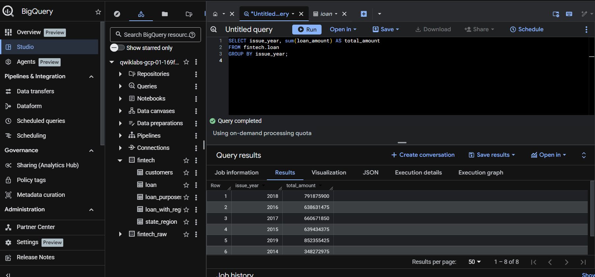
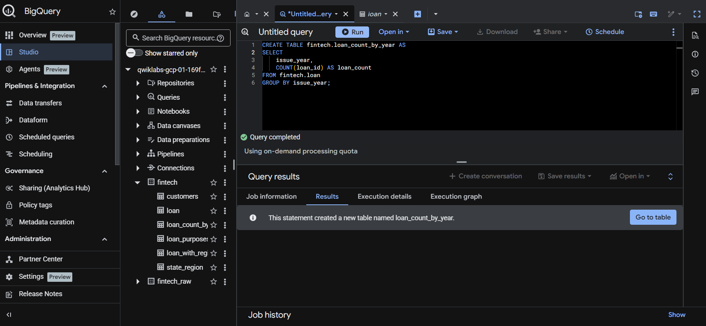
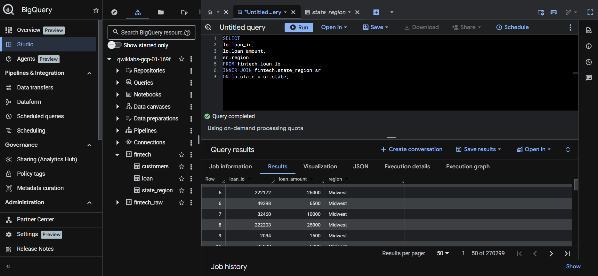

# Loan Portfolio Analysis Dashboard

This project presents a business intelligence dashboard analyzing a loan portfolio using Bigquery and Looker.

The goal of the dashboard is to provide insights into the current state of outstanding loans, identify risk patterns, and highlight high-value customers.

## Project Overview

This project analyzes a financial loan portfolio using SQL, BigQuery, and Looker.

The objective of the dashboard is to provide visibility into the current state of outstanding loans, identify potential risk patterns, and highlight high-income customers with active loans.

## Data Preparation with BigQuery

Before building the dashboard in Looker, SQL queries were executed in BigQuery to explore and prepare the dataset.

Some tasks included:

• Creating tables with aggregated loan metrics  
• Extracting distinct loan purposes  
• Calculating the number of loans issued per year  
• Exploring nested fields in the dataset

Below are examples of SQL queries executed during the analysis.

## Dashboard Preview

## Tools Used

• Looker  
• Google BigQuery  
• SQL  
• Google Cloud Platform

## Data Preparation

SQL queries were executed in BigQuery to explore and prepare the dataset before building the dashboard.

Tasks included:

• Extracting distinct loan purposes  
• Aggregating loan counts by year  
• Exploring nested fields within the dataset

## Key Metrics

The dashboard includes:

• Total Outstanding Loan Balance  
• Distribution of loans by status  
• Geographic concentration of loans by state  
• Top customers by annual income

## Business Questions

This dashboard was designed to help answer the following business questions:

- What is the total outstanding balance of the loan portfolio?

- What proportion of loans are currently active versus at risk?

- Which states concentrate the highest number of outstanding loans?

- Who are the highest-income customers with active loans?

## Key Insights

Most loans are currently in good standing, suggesting a relatively healthy portfolio.

A smaller portion of loans fall into late payment categories, representing potential credit risk.

Some states concentrate a higher number of outstanding loans, which may require additional monitoring.

High-income customers represent an important segment with active loans.

## Purpose

This project demonstrates how business intelligence tools can be used to analyze financial data and support data-driven decision making.
