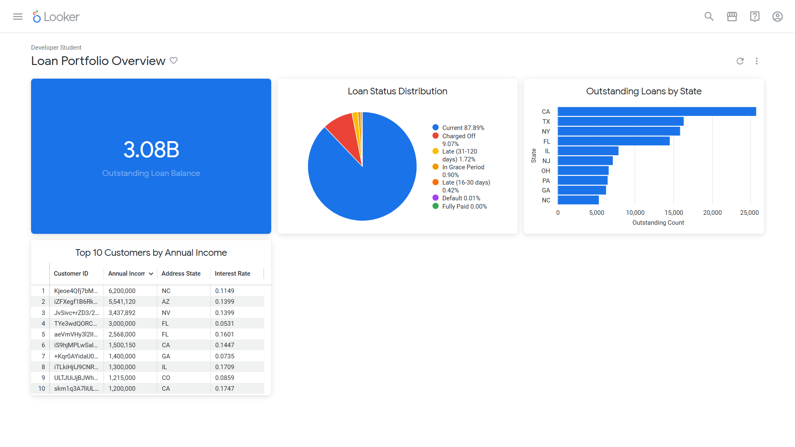

# Loan Portfolio Analysis Dashboard

This project presents a business intelligence dashboard analyzing a loan portfolio using Looker.

The goal of the dashboard is to provide insights into the current state of outstanding loans, identify risk patterns, and highlight high-value customers.

## Dashboard Preview

## Tools Used

- Google Cloud Platform
- Looker
- SQL
- Data Visualization

## Key Metrics

The dashboard includes:

• Total Outstanding Loan Balance  
• Distribution of loans by status  
• Geographic concentration of loans by state  
• Top customers by annual income

## Insights

From this analysis, we can observe:

• The majority of loans are currently active and in good standing  
• A smaller portion of the portfolio shows risk through late payments or charge-offs  
• Some states concentrate a higher number of outstanding loans, which may require additional monitoring  
• High-income customers represent a valuable segment with active loans

## Purpose

This dashboard demonstrates how business intelligence tools can be used to monitor loan portfolios, identify risk signals, and support data-driven decision making.
